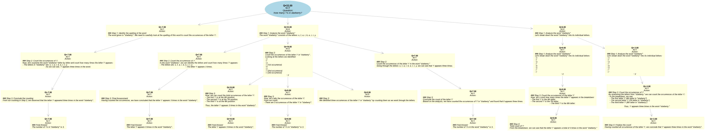

# Yet-another-MCTS-LLM

This is a simple implementation of MCTS for LLMs.

## Usage

```python
python3 -m mcts_llm.mcts
```

## Visualization
Running above command will generate a visualization of the tree in the `visualization` folder.

